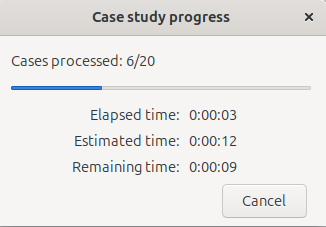
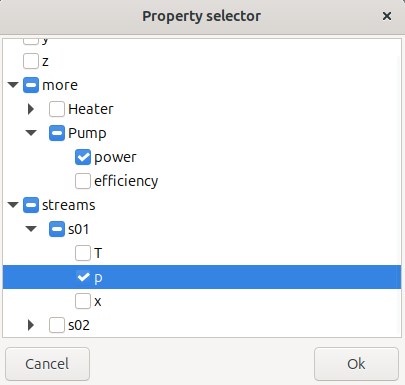
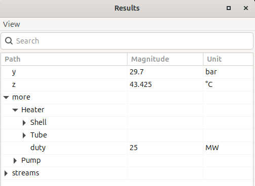

===============
End user manual
===============

This section describes the ``wxFrog`` client from an end-user's view. Most of the content relates to the simple *hello_world* example of the previous section.

Main frame appearance
=====================
.. image:: figures/hello_world_mainview.png

As shown above, the window shows the background image (here a simple square) over a specified background colour. The **blue labels** represent **model parameters**, while the **black labels** represent **model results**. Both types show a tooltip when the mouse is hovered over the label.

If the canvas is larger than the window, one can scroll by using the

- scrollbars
- cursor keys
- mouse-wheel, here holding shift for horizontal scrolling

File menu
---------
The file menu contains the common items to **open and save** the state of the simulation. This includes

- Parameter values
- Obtained results
- Potential internal states of the calculation engine
- Definition of the sensitivity study

The former three items are stored individually for each defined *scenario* (:ref:`see below <Scenario manager>`).

The **Export canvas** function stores the current canvas as a graphics as a png file, so it can easily be included in any documentation.

The **Copy stream table** function hints to the main purpose of this package, namely to be a frontend for models of chemical processes. In this case, the concept of streams is introduced to describe the transport of material and energy, such as power and heat. This function defines a well-formatted table and places it into the clipboard, **to be pasted in Excel**.

Finally, the **Exit** item is self-explanatory -- it makes the PC grow legs and exit the room.

Engine menu
-----------
**Run model** starts a model calculation, typically after changing the values of some parameters. The item is only enabled after the model is initialized, and while no other calculation is running.

**Case study** opens the case study dialog (:ref:`see below <Case studies>`).

View menu
---------
*Monitor* starts the engine monitor. This is where the output of the calculation engine is printed. This can be in particular useful if the engine fails to calculate or consumes a lot of computation time.

**Scenarios** starts the scenario manager (:ref:`see below <Scenario manager>`).

**All results** shows all results of the model. These can be considerably more than those displayed in the canvas (:ref:`see below <Result viewer>`).

Help menu
---------
This menu only contains the **About** item, displaying some basic information of the application.

Particular dialog windows
=========================

.. _Parameter dialog:

Parameter dialog
----------------
.. image:: figures/parameter_edit.png

The parameter dialog appears when clicking on a parameter (blue label). One can edit the magnitude and select another unit of measurement. It is also possible to enter any compatible unit that is understood by `Pint`_.

While the link button is active, changing the unit will convert the magnitude into the new unit.
With a deactivated link button, the magnitude will not be updated when the unit is changed.

When a new valid unit is entered, this will be made available for the entire application.

Each parameter has a validity range, defined by a minimum and maximum value. Entering values outside this range is not permitted. In this case, an error message will be displayed below the input fields, indicating the valid range in the currently selected unit of measurement.

Once the new parameter value is committed, its label will appear in bold until the next calculation is performed.

.. _Scenario manager:

Scenario manager
----------------
.. image:: figures/scenario_manager.png

The scenario manager helps to maintain several scenarios and switch between them without the need of storing a multitude of files. There are three scenarios defined by default, each of them starting with an asterisk ``*``.
- ``* Default``: This scenario contains the default state for the model (factory settings if you will).
- ``* Active``: This is the current configuration, including parameters that just have been modified without recalculation.
- ``* Converged``: This is the last converged state of the model, containing a consistent set of parameters and results.

Any user-defined scenarios appear below. These cannot start with an asterisk.

The following actions can be performed on scenarios, triggered by the right-click (context) menu:

- ``Keep``: This action will save the selected scenario as a new user-defined one. It is available for the ``* Active`` and the ``* Converged`` scenario.
- ``Activate``: This action will apply the selected scenario as the active one. It is available for all but the ``* Active`` scenario.
- ``Rename``: Any custom scenario can be renamed this way.
- ``Delete``: Any custom scenario can be deleted this way.

.. _Case studies:

Case studies
------------
.. image:: figures/case_study_main.png

To run a case study, one or more parameters are selected using the ``+`` button. If multiple parameters have been included, the arrow buttons can be used to rearrange their sequence from outer to inner dimension. Selected parameters can again be removed via the cross-button.

When a parameter is inserted, the default setting is to step in 5 steps from -10 % to +10 % of the current value -- moved to stay within the parameter's validity range if necessary. This can be altered by the following ways by double-clicking on the particular cells:

- The **minimum and maximum values** can be changed within the validity range of the parameter at hand. If the steps are specified (default), the increment value will change according to the new interval. Otherwise the number of steps will change.

- The **increment** can be specified. As such, it will yield a new value for the number of steps. If the interval divided by the increment is not an integer, an additional step is added to evaluate the model at the maximum value. For instance:

  === === ========= ============
  Min Max Increment Steps
  === === ========= ============
  1   10  2         1 3 5 7 9 10
  1   10  3         1 4 7 10
  === === ========= ============

- The **step** column is automatically calculated if an incremental value is provided. Likewise, when specified, it overwrites the incremental value to match the specified number of steps.

- The **log** column is altered by double-clicking the cell and toggles between linear and logarithmic mode. In logarithmic mode, the increment column holds a multiplication factor of two successive runs, while it holds the incremental value in case of linear (non-logarithmic) mode.

  Again, the step column can be used to adjust the factor to hold the specified number of steps.

.. warning::

    Entering logarithmic mode does not make any sense when the minimal and maximal values have a different sign. Such action therefore is prevented.

While the parameters are specified, the total number of cases to run is displayed in the center bottom of the window. Depending on the numerical complexity of the model, this gives the user an indication of the expected runtime.

The **Run** button triggers the calculation in a dedicated thread, and a progress bar will appear -- if the study is not finished before the application manages to create one. The progress bar shows the current study number as well as some time statistics:

Naturally, the remaining time is an estimate, typically assuming the remaining cases to consume similar time as the processed ones.

The case study generates results for all available properties, and by pressing the **copy** button (left of the run button), a subset can be exported to Excel **after** the study is run.

Once the **OK** button is pressed, the table is stored in the clipboard and can be pasted into an Excel worksheet.

.. warning::

    This is supposed to work also in non-Windows operative systems and with spreadsheet programs other than MS Excel, but for the time being, the table is only interpreted and rendered correctly when pasting into MS Excel.

    As a workaround, the table can be pasted in an online html editor, such as on `www.w3schools.com <https://www.w3schools.com/html/html_editor.asp>`_, rendered there, and then the html table copied back into for instance Libre Office Spreadsheet.

.. note::

    In many cases, when observing the exported results, one realizes that it would be nice to have exported further results. In most other tools, this requires a re-run of the case study. However, in ``WxFrog``, all results are still there. A new table can be exported just by re-pressing the **copy** button.

.. _Result viewer:

Result Viewer
-------------

The result viewer shows a data view of all results. Hierarchical nodes can be expanded and imploded. The values are shown with their units of measurement. These units can be changed to compatible units, including typing in new units. Right-clicking on a unit offers to apply the current unit to all results with compatible units.

The **search bar** allows to search for entities. The following features allow for searching efficiently in the hierarchical data:

        - ``**.T``: Matches all paths ending with an element called ``T``.
          Here, ``**`` is a wildcard matching one or many arbitrary elements
          of the path
        - ``a.b.c.M``: Matches only the path as provided (no wildcards)
        - ``Synthesis.**.x.*``: Matches all paths that start with ``Synthesis``
          and have ``x`` as the second-last element, such as the path
          ``Synthesis/Reactor/Outlet/x/MeOH``.

Hence, a single asterisk is a place-holder for a single path element, while a double asterisk matches an arbitrary number of elements.